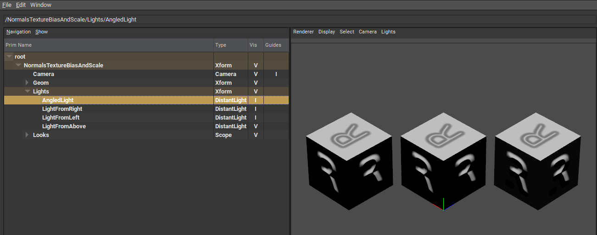
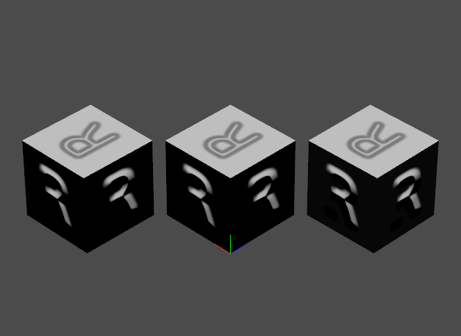
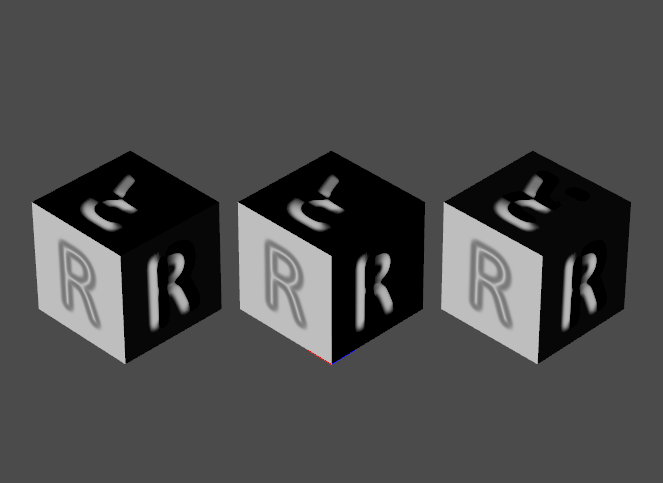
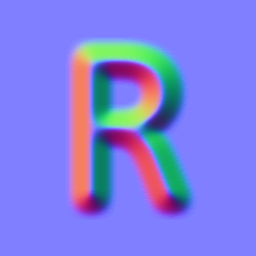

# Normals Texture Bias And Scale
This test file, NormalsTextureBiasAndScale.usda, is for testing how well a USD display application interprets the bias and scale inputs for normal map textures. Each cube uses a different normal map texture, combined with different bias and scale values applied to that texture, to give what should be an identical result. Cubes are 10 cm in size so that the USDZ file is more usable in XR applications. The USDZ file can be [downloaded directly](https://erich.realtimerendering.com/mcusd/NormalsTextureBiasAndScale.usdz) for viewing on phones, etc.

The usdview program from the [USD Toolset](https://graphics.pixar.com/usd/release/toolset.html) includes a basic hydra GL rasterizing renderer. It's about as basic a render you can make, but it's also the standard, in that it's the renderer Pixar provides.

It is possible to build [usdview from scratch](https://graphics.pixar.com/usd/release/toolset.html), but [NVIDIA's Omniverse Launcher](https://www.nvidia.com/en-us/omniverse/) provides a pre-built version of the USDView application. Images shown were generated with USDView 0.23.2.

Load procedure: File -> Open and select NormalsTextureBiasAndScales.usda. Press F11 to toggle on the hierarchy view (if not already visible). Open the "root" by double-clicking on it. Select the "Camera" and right-click, then pick (at the bottom) "Set As Active Camera". You should see:

Open the "NormalsTextureBiasAndScale" Xform under "root". The scene has four light sources in it, with just one enabled, the "AngledLight" that comes roughly from the camera's direction. You can toggle these lights on and off in USDView by clicking on the V (visible) or I (invisible) values to the right of each. For example, here are the settings and where I clicked to make the "LightFromAbove" visible and affect the scene:

Toggling the various lights can show whether the three cubes respond to the light in the same way.

If the viewer being checked does not read in and use the camera, simply adjust the view. In order to get a corresponding view, use the "R" orientation on the tops of the cubes to make sure you're looking at the fronts of the three cubes.

If the viewer doesn't import the lights, you are on your own. Whatever light you use, the three cubes should appear nearly the same. Pay particular attention to whether the left edge and top of the R is light or dark.

Lit from above:

Lit from left:

Lit from right:

## Technical Details
There are two sorts of normal map textures seen in practice: [object space and tangent space](http://wiki.polycount.com/wiki/Normal_Map_Technical_Details). Object space normal map textures give a set of normals that can point in any direction. These directly replace the object's normals at various mapped locations, relative to the object's frame of reference. Object space normal maps are rarely used in modern applications, because they are inflexible (baked in) and higher tessellation rates hide [tangent space discontinuities](https://docs.cryengine.com/display/SDKDOC4/Tangent+Space+Normal+Mapping#TangentSpaceNormalMapping-DrawbacksofTangentSpaceLighting).

In tangent space normal map textures, a triangle's normal points in the +Z direction, and there are X+ and Y+ directions defined for the triangle, so allowing texturing. A tangent space normal map contains XYZ normals that are relative to this surface's orientation. If the triangle's coordinates change to rotate it in space, for example, the normal map does not need to be regenerated for this new set of coordinates.

While object space normal textures can have values for X, Y, and Z that range between -1 and 1, this is not true for tangent space textures. It is already a bit weird to change the normal so that it is not the same as the geometric normal (e.g., rays reflecting off such normals could pass into the surface, not something that happens in real life). But one thing that is not allowed is for the normals themselves to point into - below - the surface. This constraint means that the Z value is in the range 0 to 1, which is why you will see normal textures with this range instead of -1 to 1. Such a mapping is a bit different for tangent vs. object space. Literally, a single bit. You can get one more bit of precision for the Z coordinate if you use the range 0 to 1 instead of -1 to 1. In practical terms, this extra precision usually does not matter.

### Normal Map Creation
Normal map textures use the raw RGB values in an image to generate a local surface normal. The three normal map textures are generated from the same heightfield texture:

Black is low, white is high.

The three normal maps were generated using the [NormalMap Online page](https://cpetry.github.io/NormalMap-Online/).

Steps: First the r_bump_map.png image is dropped into the left window. To generate the three normal map textures, used in the three cubes, left to right:
* r_normal_map.png - created by using the "Invert R" setting in the NormalMap Online tool and by checking the box next to "Z Range". This represents USD's default normal map, AKA the "OpenGL" format.
* r_normal_map_reversed_x_0_bias_z.png - created by unchecking all "Invert" settings and unchecking the "Z Range" box. This reverses the X direction for the texture and maps the Z (height) value from 0 to 1. Not commonly seen, but possible.
* r_normal_map_reversed_y.png - created by checking "R" and "G" in the "Invert" settings and by checking the box next to "Z Range". This reverses the Y direction, giving what is sometimes called the "DirectX" format, commonly used in games.

These are the textures applied to the cubes. The left cube has r_normal_map.png applied to all faces, middle has r_normal_map_reversed_x_0_bias_z.png, right has r_normal_map_reversed_y.png. Looking at each texture applied, the "no bump here" color is always (127,127,255), a distinctive light blue that converts (as expected) to the normal (0,0,1), pointing outward from the surface.

### Normals Conversions
Here is the r_normal_map.png:

The default type of normal map texture, i.e., the settings in the USDA file are:

    float4 inputs:bias =  (-1, -1, -1, -1)
    float4 inputs:scale = ( 2,  2,  2,  2)

which are the defaults in [UsdPreviewSurface specification](https://graphics.pixar.com/usd/release/spec_usdpreviewsurface.html). 

Looking at r_normal_map.png's colors, you can identify normals pointing to the right as having a mostly red value, e.g., along the right loop of the "R" (or, easier, along the right edge of the vertical line forming the left of the "R") you will find (246,127,175).

To convert an integer RGB triplet into a tangent space normal takes three steps:
1. change it to a floating point number from 0.0 to 1.0 by dividing by 255;
2. multiply by its scale factors; and
3. add in the bias.

For example, start with (246,127,175):
* divide that by 255 to get to the range 0.0 to 1.0: (0.965, 0.498, 0.686);
* multiply by scale (2,2,2) - the fourth "2" is not needed: (1.929, 0.996, 1.373);
* add bias (-1,-1,-1): (0.929, -0.004, 0.373) is the resulting local normal, which has a length of 1.003

From testing in USDView (it's not specified in the specification), the +X axis of the texture is to the right, +Y up, +Z outward to the viewer. The example surface normal points quite far to the right, X=0.929 and Z=0.373. The +Y is nearly zero (exactly zero would be 127.5 originally, a value we can't represent), meaning the normal doesn't (much) point up or down, relative to the Y axis tangent the surface.

The colors of the normals in any normal map can tip you off. The rightward pointing normal was mostly red. Upward pointing normals, like along the top of the "R", are mostly green, such as (127,233,142). On the left edge of the "R", pointing to the left, you get a more dark greenish teal, (22,127,142), and bottom-pointing gives a dark bluish purple, (127,83,239).

 For the other two textures, r_normal_map_reversed_x_0_bias_z.png and r_normal_map_reversed_y.png, they (should) render pretty much the same as our left, default-mapping cube. These correctly look the same in the USDView images shown earlier. 
 
 Specifically, for the r_normal_map_reversed_x_0_bias_z.png normal map:

the bias and scale for the "r_normals_reversed_x" cube, displayed in the middle, are:

    float4 inputs:bias =  ( 1, -1, 0, -1)
    float4 inputs:scale = (-2,  2, 1,  2)

Note how the X (red) component is negated in both bias and scale, and the Z (blue) component is converted to the range 0 to 1. These are not what usdzip expects, for example. If you use usdzip's "-c", check compliance, option you'll get the warning:

    UsdUVTexture prim </Looks/RNormalsReversedX0BiasZ/NormalTexture> reads an 8 bit Normal Map, but has non-standard
	inputs: scale and inputs:bias values of (-2, 2, 1, 2) and (1, -1, 0, -1) (may violate 'NormalMapTextureChecker')

This reversed X and remapped Z example is not a normal map combination you'll likely ever see anywhere else. It is here purely for testing these two possibilities, each of which I've seen used in some normal maps.

For the r_normal_map_reversed_y.png normal map:

for the "r_normals_reversed_y" cube, displayed on the right:

    float4 inputs:bias =  (-1,  1, -1, -1)
    float4 inputs:scale = ( 2, -2,  2,  2)

Here the green (Y) component is negated in both bias and scale. This type of adjustment is used in the McUsd.usda test file for all normal maps, in fact, testing the feature. This is needed when converting from "DirectX style" Y is down along the surface normal map textures, often seen in games, to USD's "OpenGL style", Y is up standard. Various digital content creation apps [use one or the other](http://wiki.polycount.com/wiki/Normal_Map_Technical_Details#Common_Swizzle_Coordinates).

This flip will also be flagged by usdtools with "-c":

    UsdUVTexture prim </Looks/RNormalsReversedY/NormalTexture> reads an 8 bit Normal Map, but has non-standard
    inputs: scale and inputs:bias values of (2, -2, 2, 2) and (-1, 1, -1, -1) (may violate 'NormalMapTextureChecker')

Compare r_normal_map_reversed_x_0_bias_z.png with r_normal_map.png and you'll see the "reddish" and "dark greenish teal" parts of the map are swapped. For r_normal_map_reversed_y.png the "greenish" parts are swapped with the "dark bluish purple" parts.

### Warning with Tools
If you work with any tools, be careful about resizing normal map images. For example, if you take a 256x256 normal map image and scale it down to 64x64, you are averaging normals together to get the result. Doing so will make the normals stored no longer be normalized, of length 1.0. This can affect some renderers. Better is to use the original grayscale heightfield bump map and scale it down before converting to normals.

### Other Formats
One last thing worth noting is that some specialized formats use the Z (blue) channel for other data. Since it's given that the normal stored is normalized, when the Z value is always greater than or equal to 0.0 you can then derive Z from X and Y, i.e.,

    Z = sqrt(1 - X*X - Y*Y)

Some applications, such as [CryEngine](https://docs.cryengine.com/display/SDKDOC4/Tangent+Space+Normal+Mapping#TangentSpaceNormalMapping-NormalMapCompression) discard the Z channel and make the texture have just two channels. The [BC5 compression format](https://www.reedbeta.com/blog/understanding-bcn-texture-compression-formats/#bc2-bc3-and-bc5) is often used for these two-channel normal maps.

Others, to avoid the unusual two-channel format, reuse the unneeded channel(s) for other attributes. For example, in the Minecraft [LabPBR format](https://wiki.shaderlabs.org/wiki/LabPBR_Material_Standard), the Z channel is instead used to hold an ambient occlusion percentage. So, if you see a constant Z value (e.g., all 256) or other values that don't seem to give normals of length 1.0, this may be the reason.

## Related glTF Test Models
There are two related (and more elaborate) glTF sample models that may be of interest, the [Normal-Tangent Test](https://github.com/KhronosGroup/glTF-Sample-Models/tree/master/2.0/NormalTangentTest) and the [Normal-Tangent Mirror Test](https://github.com/KhronosGroup/glTF-Sample-Models/tree/master/2.0/NormalTangentMirrorTest). _(Thanks to Eric Chadwick for the pointers.)_

The [glTF 2.0 specification](https://registry.khronos.org/glTF/specs/2.0/glTF-2.0.html#additional-textures) clearly maps RGB to the -1 to +1 range for all three channels, with the additional constraint that Z values must be positive value. The [specification also describes the mapping used](https://registry.khronos.org/glTF/specs/2.0/glTF-2.0.html#_material_normaltexture), "+X is right and +Y is up. +Z points toward the viewer."

These match USD's default settings.

---
## License
**[CC-NC-BY-SA](LICENSE)**

---
# Contact
Email the author, [Eric Haines](http://erichaines.com), at [erich@acm.org](mailto:erich@acm.org).