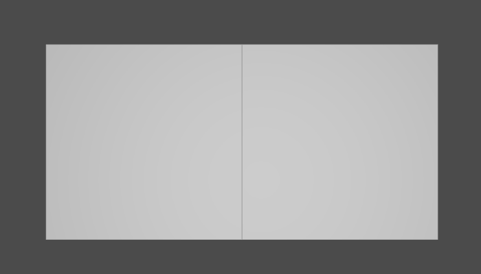
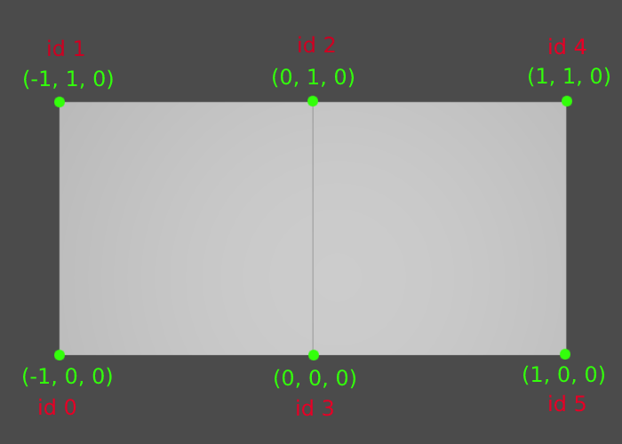
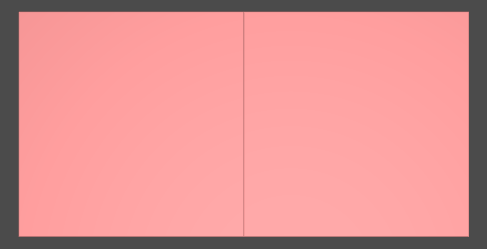
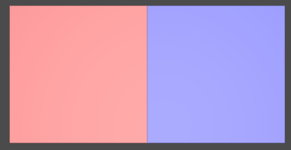
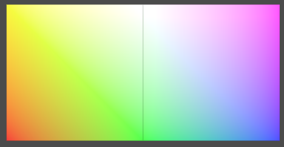
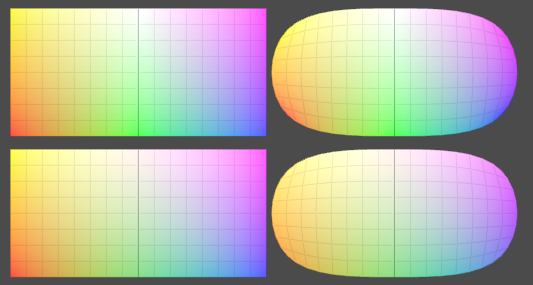

# Primvar Interpolation


USD specifies five types of interpolation for primvars in the documentation on [Interpolation of Geometric Primitive Variables](https://graphics.pixar.com/usd/release/api/class_usd_geom_primvar.html#Usd_InterpolationVals):

- constant
- uniform
- varying
- vertex
- faceVarying

These follow [Renderman conventions](https://renderman.pixar.com/resources/RenderMan_20/appnote.22.html#Class%20Specifiers) for primitive variables.

This example asset demonstrates each primvar interpolation type on Mesh prims. The example was inspired by / plagiarized from a [usd-interest post by Jeremy Cowles](https://groups.google.com/g/usd-interest/c/MqYLLkp-rYA). 
These interpolation types have different meanings and behaviors on other types of geometry prims (BasisCurve, etc) - a useful further contribution to this asset would be examples and documentation of primvar interpolation with other prim types.

## Mesh construction

It will be helpful to review how mesh geometry is defined in USD. For this example, we define a mesh with two faces:

```
def Mesh "example"
{
    float3[] extent = [(-1, 0, 0), (1, 1, 0)]
    point3f[] points = [(-1, 0, 0), (-1, 1, 0), (0, 1, 0), (0, 0, 0), (1, 1, 0), (1, 0, 0)]
    int[] faceVertexCounts = [4, 4]
    int[] faceVertexIndices = [3, 2, 1, 0, 5, 4, 2, 3]
}
```



The mesh is constructed from six vertices, which are defined using the **points** attribute:

```
point3f[] points = [(-1, 0, 0), (-1, 1, 0), (0, 1, 0), (0, 0, 0), (1, 1, 0), (1, 0, 0)]
```

This image shows the points and their indices within the **points** array:



Once the points are defined, the **faceVertexCount** and **faceVertexIndices** attributes define how a mesh is constructed from those points. **faceVertexCount** is an ordered array of how many points / vertices are used to define each face of the mesh. **faceVertexIndices** is an ordered array of _which_ points / vertices comprise each face, using the index of the points as defined in the **points** attribute. 


The order of the **faceVertexIndices** array aligns with the order of the **faceVertexCounts** array. If the first face listed in the **faceVertexCounts** array has _four_ points, then the first _four_ entries **faceVertexIndices** array define the points that comprise the first face of the mesh. If we name our faces A and B, these attributes define A and B in this order:

```
int[] faceVertexCounts = [4, 4]
# int[] faceVertexCounts = [A, B]
int[] faceVertexIndices = [3, 2, 1, 0, 5, 4, 2, 3]
# int[] faceVertexIndices = [A_0, A_1, A_2, A_3, B_0, B_1, B_2, B_3]
```


## Primvar interpolation with Mesh prims

For these examples, we'll use the displayColor primvar, because Storm and most other render delegates can display it natively.

The example file [primvar_interpolation.usda](primvar_interpolation.usda) was used to generated the screenshot in the overview of this document, and contains all of the examples discussed below.

### Constant



```
color3f[] primvars:displayColor = [(1, 0.3, 0.3)] (
    interpolation = "constant"
)
```

**Pixar's definition**
> One value remains constant over the entire surface primitive.

**Size of primvar array**

1

**Notes**

With constant interpolation, a single value is specified for the entire prim. It is important to note, this is still specified as an array, even though it will only have a single entry. For a color3f (which is a tuple of three values) primvar like displayColor, a constant primvar is an array of a single tuple, as in the example above.

### Uniform



```
color3f[] primvars:displayColor = [(1, 0.3, 0.3), (0.3, 0.3, 1)] (
    interpolation = "uniform"
)
```

**Pixar's definition**
> One value remains constant for each uv patch segment of the surface primitive (which is a face for meshes).

**Size of primvar array**

The number of faces on the mesh, which is the same as the length of **faceVertexCounts** array.

**Notes**

With uniform interpolation, one value is specified for each face of the mesh. The order of the array matches the order of the **faceVertexCounts** array:

```
int[] faceVertexCounts = [4, 4]
# int[] faceVertexCounts = [A, B]

color3f[] primvars:displayColor = [(1, 0.3, 0.3), (0.3, 0.3, 1)] (
    interpolation = "uniform"
)
#color3f[] primvars:displayColor = [A, B] (
#    interpolation = "uniform"
#)
```

### Varying


```
color3f[] primvars:displayColor = [(1, 0, 0), (1, 1, 0), (1, 1, 1), (0, 1, 0), (1, 0, 1), (0, 0, 1)]  (
    interpolation = "varying"
)
```

**Pixar's definition**
> Four values are interpolated over each uv patch segment of the surface. Bilinear interpolation is used for interpolation between the four values.

**Size of primvar array**

The number of vertices on the mesh, which is the same as the length of **points** array.

**Notes**

With varying interpolation, one value is specified for each vertex of the mesh - in game engines, this is generally known as "vertex colors". The order of the array matches the order of the **points** array:

```
point3f[] points = [(-1, 0, 0), (-1, 1, 0), (0, 1, 0), (0, 0, 0), (1, 1, 0), (1, 0, 0)]
# point3f[] points = [N, M, O, P, Q, R]

color3f[] primvars:displayColor = [(1, 0, 0), (1, 1, 0), (1, 1, 1), (0, 1, 0), (1, 0, 1), (0, 0, 1)]  (
    interpolation = "varying"
)
#color3f[] primvars:displayColor = [N, M, O, P, Q, R]  (
#    interpolation = "varying"
#)
```

### Vertex



```
color3f[] primvars:displayColor = [(1, 0, 0), (1, 1, 0), (1, 1, 1), (0, 1, 0), (1, 0, 1), (0, 0, 1)] (
    interpolation = "vertex"
)
```

**Pixar's definition**
> Values are interpolated between each vertex in the surface primitive. The basis function of the surface is used for interpolation between vertices.

**Size of primvar array**

The number of vertices on the mesh, which is the same as the length of **points** array.

**Notes**

With vertex interpolation, one value is specified for each vertex of the mesh. The order of the array matches the order of the **points** array:

```
point3f[] points = [(-1, 0, 0), (-1, 1, 0), (0, 1, 0), (0, 0, 0), (1, 1, 0), (1, 0, 0)]
# point3f[] points = [N, M, O, P, Q, R]

color3f[] primvars:displayColor = [(1, 0, 0), (1, 1, 0), (1, 1, 1), (0, 1, 0), (1, 0, 1), (0, 0, 1)]  (
    interpolation = "vertex"
)
#color3f[] primvars:displayColor = [N, M, O, P, Q, R]  (
#    interpolation = "vertex"
#)
```

You probably noticed that **varying** and **vertex** interpolation are quite similar. The differences between them are subtle, and relate to how they interact with subdivision on the mesh. You can see some differences in the example below, where the Mesh prims have a duplicate to their side that sets `token interpolateBoundary = "edgeOnly"`, which causes the corners of the mesh to be rounded when subdivision is applied. **varying** is on top, **vertex** is on the bottom. Note the stronger colors in the "corners" of the rounded mesh with **varying** interpolation. Tools that export polygonal mesh data that is explicitly not intended to be subdivided should use **varying** interpolation in addition to setting the mesh subdivision scheme to **none** - this will ensure that the mesh renders correctly for downstream consumers that _do_ support subdivision.



### Face-varying


```
color3f[] primvars:displayColor = [(0, 1, 0), (0, 0, 1), (1, 1, 0), (1, 0, 0), (0, 0, 1), (0, 0, 1), (1, 1, 0), (1, 1, 0)] (
    interpolation = "faceVarying"
)
```

**Pixar's definition**
> For polygons and subdivision surfaces, four values are interpolated over each face of the mesh. Bilinear interpolation is used for interpolation between the four values

**Size of primvar array**

The sum of number of vertices on each face of the mesh, which is the same as the length of **faceVertexIndices** array.

**Notes**

With faceVarying interpolation, one value is specified for each vertex of each face. The order of the primvar array matches the order of the **faceVertexIndices** array:

```
int[] faceVertexIndices = [3, 2, 1, 0, 5, 4, 2, 3]
# int[] faceVertexIndices = [E, F, G, H, I, J, K, L]

color3f[] primvars:displayColor = [(0, 1, 0), (0, 0, 1), (1, 1, 0), (1, 0, 0), (0, 0, 1), (0, 0, 1), (1, 1, 0), (1, 1, 0)] (
    interpolation = "faceVarying"
)
#color3f[] primvars:displayColor = [E, F, G, H, I, J, K, L] (
#    interpolation = "faceVarying"
#)
```

faceVarying interpolation allows you to specify different values for the _same vertex_ on _different faces_, which allows you to achieve unique interpolation of primvar values across each face without affecting interpolation of primvar values on surrounding faces. In this example, we demonstrate this concept with a hard discontinuity in colors at the boundary between faces.
